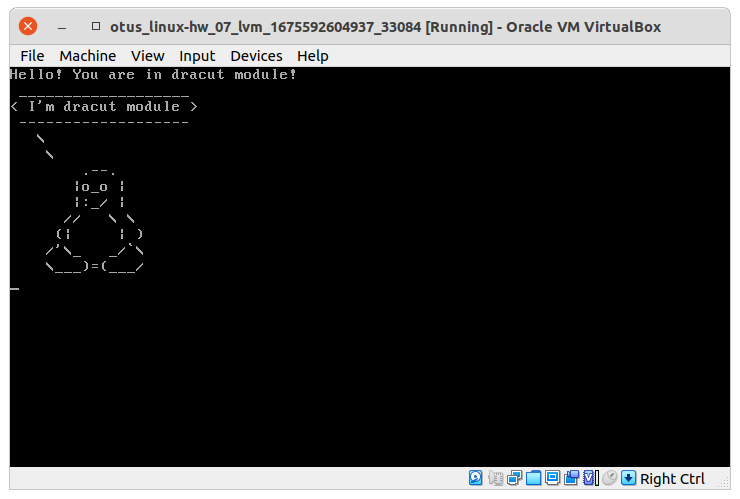

# otus_linux-hw_07

### Задание 1

#### Зайти в систему без пароля / Сбросить пароль root'а

Для сброса пароля надо перезагрузить систему. Если grub "тихо"
пропускает меню (timeout == 0), то при загрузке надо зажать `shift`
(если bios) или нажать `esc` (если uefi).

Далее выбираем интересующий нас пункт.

##### Если есть пункт меню "Recovery"
- Выбираем его

##### Если нет
- Выбираем интересующий нас пункт меню
- Нажимаем клавишу "e"

- В конце строки начинающейся с `linux16`
##### Вариант 1
    добавляем `init=/bin/sh`

##### Вариант 2
    добавляем `init=/sysroot/bin/sh`

##### Вариант 3
    добавляем `rd.break`

- Нажимаем `сtrl-x` для загрузки в систему


##### Если система загрузилась с правами `ro` на `/`
Для вариантов с изменением строки `linux16`: заменить `ro` на `rw`

Для всех вариантов: после загрузки системы `# mount -o remount,rw /`

##### Далее для выполняем команды
```sh
[vagrant@lvm ~]# chroot /sysroot
[vagrant@lvm ~]# passwd root
[vagrant@lvm ~]# touch /.autorelabel
```

### Задание 2

#### Установить систему с LVM, после чего переименовать VG

Систему с LVM я взял из домашней работы #2.

Работа по переименовыванию записана в скрипт [task\_02.sh](task_02.sh)

Заходим на машину и запускаем скрипт.

#### Проверка

Смотрим [журнал](task_02.log) работы скрипта. Если нет ошибок, сравниваем
результат вывода команд vgs вначале и вконце скрипта. В случае удачи
видим [старое](task_02.log#L6) и [новое](task_02.log#L12) названия соответственно.

### Задание 3

#### Добавить модуль в initrd


#### Проверка

Проверяем [журнал](task_03.log) всё должно быть выполненно без ошибок.

Перзагружаем систему в окне программы монитора или через telnet, если
если есть соответствующий доступ.

При загрузке видим [Тукса](task_03_screenshot.png) нарисованного псевдографикой.





### Правки

При первом старте в Varantfile забыл перенаправить поток ошибок в файл журнала.
Переделывать не стал. Но поверьте, всё прошло удачно ;)

Сейчас выложен исправленный файл [Vagrantfile](Vagrantfile#L78)
